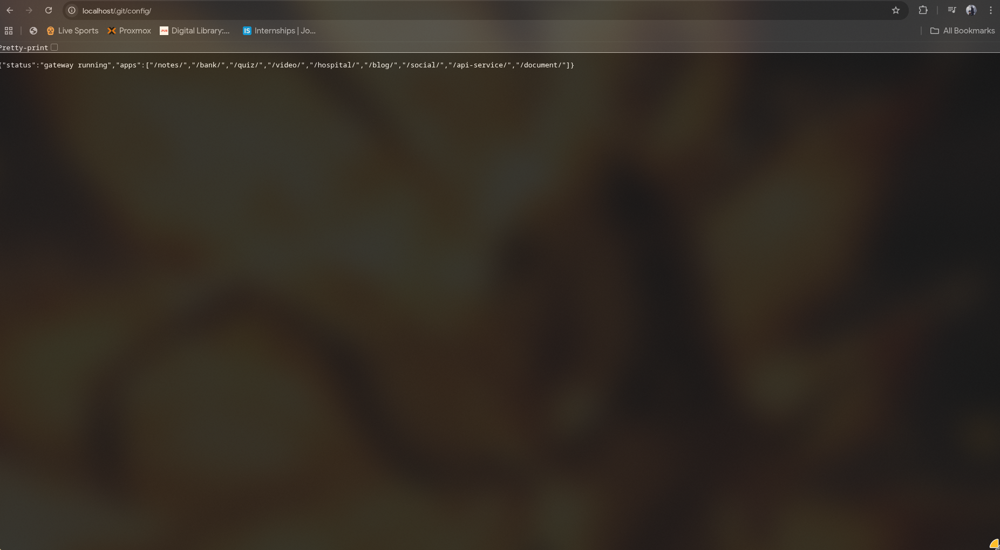
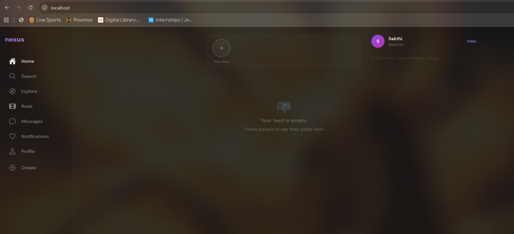
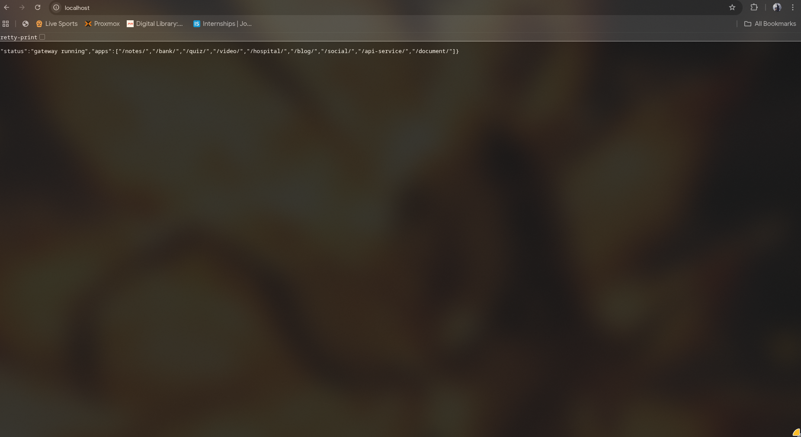

## Security Test - Terraform Ecosystem
This File has all the tests conducted to this terraform ecosystem and the fix for those issue

### Scans or Reconnaissance:

#### * Nmap Scan
```bash
nmap -sV -sC -p 80,443,8080,8000,9000,9001 localhost
Starting Nmap 7.98 ( [https://nmap.org](https://nmap.org) ) at 2026-05-01 16:54 +0530
Nmap scan report for localhost (127.0.0.1)
Host is up (0.000099s latency).
Other addresses for localhost (not scanned): ::1

PORT STATE SERVICE VERSION
80/tcp open http nginx 1.29.8
|_http-server-header: nginx/1.29.8
|_http-title: Site doesn't have a title (application/octet-stream, application/json).
443/tcp closed https
8000/tcp closed http-alt
8080/tcp open tcpwrapped
9000/tcp closed cslistener
9001/tcp closed tor-orport

Service detection performed. Please report any incorrect results at [https://nmap.org/submit/](https://nmap.org/submit/) .
Nmap done: 1 IP address (1 host up) scanned in 11.36 seconds
```
As you can see, there are several ports opened like nginx one and tcpwrapped but there are important ports which are closed like tor-orport and https so we can conclude from this nmap scan that major ports are closed like mqsql or postgresql ports

#### _ gobuster enumerate dir scan
```bash
gobuster dir -u http://localhost/ -w /usr/share/dirb/wordlists/common.txt -t 20 --exclude-length 137
===============================================================
Gobuster v3.8.2
by OJ Reeves (@TheColonial) & Christian Mehlmauer (@firefart)
===============================================================
[+] Url: http://localhost/
[+] Method: GET
[+] Threads: 20
[+] Wordlist: /usr/share/dirb/wordlists/common.txt
[+] Negative Status codes: 404
[+] Exclude Length: 137
[+] User Agent: gobuster/3.8.2
[+] Timeout: 10s
===============================================================
Starting gobuster in directory enumeration mode
===============================================================
blog (Status: 301) [Size: 169] [--> http://localhost/blog/]
social (Status: 301) [Size: 169] [--> http://localhost/social/]
Progress: 4613 / 4613 (100.00%)
===============================================================
Finished
===============================================================
```
There are actually 9 links in there with 9 different project only 2 was found, this concludes the project is not that easily exposed without the clear list

#### _ Script to scan all the ports
As you know, this project aldready uses nginx so we have a clear mapping of all ports now it's time to test all those response with curl

```bash
#!/bin/bash

paths=(

# Frontend apps
"/notes/"
"/bank/"
"/quiz/"
"/video/"
"/hospital/"
"/blog/"
"/social/"
"/api-service/"
"/document/"
"/intro/"

# API endpoints
"/notes/api/"
"/bank/api/"
"/video/api/"
"/api-service/api/"
"/document/api/"
"/hospital/api/"

# Blog specific
"/blog/admin/"
"/blog/admin/login/"
"/blog/api/"

# Social media
"/social/api/"
"/social/api/auth/me/"
"/social/api/metrics"
"/social/minio/"

# Spring Boot actuator
"/bank/api/actuator"
"/bank/api/actuator/health"
"/bank/api/actuator/env"
"/bank/api/actuator/mappings"

# Sensitive files
"/blog/robots.txt"
"/blog/.env"
"/.git/config"
"/document/api/admin/"
)

echo "=== Gateway Recon ==="
for path in "${paths[@]}"; do
  code=$(curl -o /dev/null -sw "%{http_code}" --max-time 3 http://localhost"$path")
  echo "$code => $path"
done
```

**and the result was**

```sh
./scan.sh
=== Gateway Recon ===
200 => /notes/
200 => /bank/
200 => /quiz/
200 => /video/
200 => /hospital/
200 => /blog/
200 => /social/
200 => /api-service/
200 => /document/
200 => /intro/
200 => /notes/api/
404 => /bank/api/
404 => /video/api/
200 => /api-service/api/
000 => /document/api/
404 => /hospital/api/
404 => /blog/admin/
404 => /blog/admin/login/
404 => /blog/api/
404 => /social/api/
401 => /social/api/auth/me/
404 => /social/api/metrics
403 => /social/minio/
404 => /bank/api/actuator
404 => /bank/api/actuator/health
404 => /bank/api/actuator/env
404 => /bank/api/actuator/mappings
404 => /blog/robots.txt
404 => /blog/.env
200 => /.git/config
000 => /document/api/admin/
```
don't get fooled by 200 OK response in /.git/config, the gateway is configured so any unknown path is served a response with working page like this  so now almost all the other paths are secure at most, so there is no worry here

#### * Nikto Scan
```bash
nikto -h http://localhost

- Nikto v2.6.0
---------------------------------------------------------------------------
- Your Nikto installation is out of date.
- Target IP: 127.0.0.1
- Target Hostname: localhost
- Target Port: 80
- Platform: Unknown
- Start Time: 2026-05-01 19:30:58 (GMT5.5)
---------------------------------------------------------------------------
- Server: nginx/1.29.8
- No CGI Directories found (use '-C all' to force check all possible dirs). CGI tests skipped.
- [013587] /: Suggested security header missing: referrer-policy. See: [https://developer.mozilla.org/en-US/docs/Web/HTTP/Headers/Referrer-Policy](https://developer.mozilla.org/en-US/docs/Web/HTTP/Headers/Referrer-Policy)
- [013587] /: Suggested security header missing: strict-transport-security. See: [https://developer.mozilla.org/en-US/docs/Web/HTTP/Headers/Strict-Transport-Security](https://developer.mozilla.org/en-US/docs/Web/HTTP/Headers/Strict-Transport-Security)
- [013587] /: Suggested security header missing: content-security-policy. See: [https://developer.mozilla.org/en-US/docs/Web/HTTP/CSP](https://developer.mozilla.org/en-US/docs/Web/HTTP/CSP)
- [013587] /: Suggested security header missing: x-content-type-options. See: [https://developer.mozilla.org/en-US/docs/Web/HTTP/Headers/X-Content-Type-Options](https://developer.mozilla.org/en-US/docs/Web/HTTP/Headers/X-Content-Type-Options)
- [013587] /: Suggested security header missing: permissions-policy. See: [https://developer.mozilla.org/en-US/docs/Web/HTTP/Headers/Permissions-Policy](https://developer.mozilla.org/en-US/docs/Web/HTTP/Headers/Permissions-Policy)
- [750004] /actuator/env: Spring Boot Actuator endpoint exposed (valid JSON response). See: [https://docs.spring.io/spring-boot/docs/current/actuator-api/html/](https://docs.spring.io/spring-boot/docs/current/actuator-api/html/)
- [750004] /actuator/mappings: Spring Boot Actuator endpoint exposed (valid JSON response). See: [https://docs.spring.io/spring-boot/docs/current/actuator-api/html/](https://docs.spring.io/spring-boot/docs/current/actuator-api/html/)
- [750004] /actuator/metrics: Spring Boot Actuator endpoint exposed (valid JSON response). See: [https://docs.spring.io/spring-boot/docs/current/actuator-api/html/](https://docs.spring.io/spring-boot/docs/current/actuator-api/html/)
- [750004] /actuator/beans: Spring Boot Actuator endpoint exposed (valid JSON response). See: [https://docs.spring.io/spring-boot/docs/current/actuator-api/html/](https://docs.spring.io/spring-boot/docs/current/actuator-api/html/)
- [750004] /actuator/configprops: Spring Boot Actuator endpoint exposed (valid JSON response). See: [https://docs.spring.io/spring-boot/docs/current/actuator-api/html/](https://docs.spring.io/spring-boot/docs/current/actuator-api/html/)
- [750004] /actuator/loggers: Spring Boot Actuator endpoint exposed (valid JSON response). See: [https://docs.spring.io/spring-boot/docs/current/actuator-api/html/](https://docs.spring.io/spring-boot/docs/current/actuator-api/html/)
- [750004] /actuator/threaddump: Spring Boot Actuator endpoint exposed (valid JSON response). See: [https://docs.spring.io/spring-boot/docs/current/actuator-api/html/](https://docs.spring.io/spring-boot/docs/current/actuator-api/html/)
- [750004] /actuator/auditevents: Spring Boot Actuator endpoint exposed (valid JSON response). See: [https://docs.spring.io/spring-boot/docs/current/actuator-api/html/](https://docs.spring.io/spring-boot/docs/current/actuator-api/html/)
- [750004] /actuator/httptrace: Spring Boot Actuator endpoint exposed (valid JSON response). See: [https://docs.spring.io/spring-boot/docs/current/actuator-api/html/](https://docs.spring.io/spring-boot/docs/current/actuator-api/html/)
- [750004] /actuator/scheduledtasks: Spring Boot Actuator endpoint exposed (valid JSON response). See: [https://docs.spring.io/spring-boot/docs/current/actuator-api/html/](https://docs.spring.io/spring-boot/docs/current/actuator-api/html/)
- [750004] /actuator/heapdump: Spring Boot Actuator endpoint exposed (valid JSON response). See: [https://docs.spring.io/spring-boot/docs/current/actuator-api/html/](https://docs.spring.io/spring-boot/docs/current/actuator-api/html/)
- [750004] /actuator/jolokia: Spring Boot Actuator endpoint exposed (valid JSON response). See: [https://docs.spring.io/spring-boot/docs/current/actuator-api/html/](https://docs.spring.io/spring-boot/docs/current/actuator-api/html/)
- [750004] /actuator/prometheus: Spring Boot Actuator endpoint exposed (valid JSON response). See: [https://docs.spring.io/spring-boot/docs/current/actuator-api/html/](https://docs.spring.io/spring-boot/docs/current/actuator-api/html/)
- [999967] /: Web Server returns a valid response with junk HTTP methods which may cause false positives.
- [001214] /doc: The /doc directory is browsable. This may be /usr/doc. See: [https://cve.mitre.org/cgi-bin/cvename.cgi?name=CVE-1999-0678](https://cve.mitre.org/cgi-bin/cvename.cgi?name=CVE-1999-0678)
- [001582] /bank/: This might be interesting.
- [002739] /.htpasswd: Contains authorization information.
- [007203] /userdata.json: This might be interesting.
- [007204] /login.json: This might be interesting.
- [007205] /master.json: This might be interesting.
- [007206] /masters.json: This might be interesting.
- [007207] /connections.json: This might be interesting.
- [007208] /connection.json: This might be interesting.
- [007210] /PasswordsData.json: This might be interesting.
- [007211] /users.json: This might be interesting.
- [007212] /conndb.json: This might be interesting.
- [007213] /conn.json: This might be interesting.
- [007215] /accounts.json: This might be interesting.
- [007303] /JAMonAdmin.jsp: JAMon - Java Application Monitor Admin interface identified. Versions 2.7 and earlier contain XSS vulnerabilities. See: [https://cve.mitre.org/cgi-bin/cvename.cgi?name=CVE-2013-6235](https://cve.mitre.org/cgi-bin/cvename.cgi?name=CVE-2013-6235)
- [007342] /: X-Frame-Options header is deprecated and was replaced with the Content-Security-Policy HTTP header with the frame-ancestors directive. See: [https://developer.mozilla.org/en-US/docs/Web/HTTP/Reference/Headers/X-Frame-Options](https://developer.mozilla.org/en-US/docs/Web/HTTP/Reference/Headers/X-Frame-Options)
- [007352] /: The X-Content-Type-Options header is not set. This could allow the user agent to render the content of the site in a different fashion to the MIME type. See: [https://www.netsparker.com/web-vulnerability-scanner/vulnerabilities/missing-content-type-header/](https://www.netsparker.com/web-vulnerability-scanner/vulnerabilities/missing-content-type-header/)
- 8638 requests: 0 errors and 36 items reported on the remote host
- End Time: 2026-05-01 19:31:16 (GMT5.5) (18 seconds)
---------------------------------------------------------------------------
- 1 host(s) tested
```
this was the response, again no major leaking points here there are medium security concerns tho like /doc and /.htpasswd and another thing about the spring boot exposure there is a intresting fact about my project that is uniform catch-all response if any user gives out a request to a unmapped part of nginx it gives a 200 OK response instead of other response which can expose the state of the paths and sub-paths

```bash
location / {
return 200 '{"status":"gateway running","apps":["/notes/","/bank/","/quiz/","/video/","/hospital/","/blog/","/social/","/api-service/","/document/"]}';
add_header Content-Type application/json;
add_header Server ""; # hide nginx version
add_header X-Powered-By ""; # hide tech stack
}
```
so all those path enumeration is totally useless against this method but there is a catch, if the path changes locally for that app like this  and the page refreshes  the page is gone, this is a tradeoff we get, to fix this, we have to add base='/social/' in frontend but I had never the time because then it changes rest of the frontend configs too

### Severity Ratings

#### Low : Exposed /.git/config
`200 => /.git/config`
**The Fix :** It was a side-effect of uniform catch-all response that's why we got the 200 OK it is working as intended

#### Medium : Missing Security Header in Nginx
**The Fix :** add this to nginx.conf
```bash
add_header Strict-Transport-Security "max-age=31536000; includeSubDomains" always;
add_header Content-Security-Policy "default-src 'self'" always;
add_header X-Content-Type-Options "nosniff" always;
add_header Referrer-Policy "strict-origin-when-cross-origin" always;
```

#### High : Exposed Spring Boot Actuator
**The Fix :** Aldready done, the uniform catch all response

### Exploits and Tests

#### CSRF Test

Generally, a application should not recieve the request from a outside resource, they have a protection called CSRF Policy
this Policy blocks request from outside and protect the application running 

here is the script i used to test it 

```bash
#!/bin/bash

# Auth Testing Script with CSRF Token Handling
# Tests if apps properly validate CSRF tokens

echo "=========================================="
echo "Authentication & CSRF Testing"
echo "=========================================="
echo ""

USER1="testuser_u1_$(date +%s)"
PASS="TestPass123!@#"

# ============= BLOG =============
echo "[*] Testing BLOG..."

# First, GET the login page to capture CSRF token
echo "  - Fetching login page to get CSRF token..."
BLOG_GET=$(curl -s -c /tmp/blog_cookies.txt http://localhost/blog/login/)

# Try to extract CSRF token from HTML
BLOG_CSRF=$(echo "$BLOG_GET" | grep -oP "csrfmiddlewaretoken['\"]?\s*:\s*['\"]?\K[^'\">\s]+" | head -1)

if [ -n "$BLOG_CSRF" ]; then
    echo "  ✓ CSRF Token found: ${BLOG_CSRF:0:30}..."
else
    echo "  ⚠ No CSRF token found in HTML, trying alternative method..."
    BLOG_CSRF=$(echo "$BLOG_GET" | grep -oP 'value="[^"]*csrf[^"]*"' | head -1)
fi

# Try login WITH CSRF token
if [ -n "$BLOG_CSRF" ]; then
    echo "  - Logging in WITH CSRF token..."
    BLOG_LOGIN=$(curl -s -X POST http://localhost/blog/login/ \
      -b /tmp/blog_cookies.txt -c /tmp/blog_cookies.txt \
      -H "Content-Type: application/json" \
      -d "{\"username\":\"$USER1\",\"password\":\"$PASS\",\"csrfmiddlewaretoken\":\"$BLOG_CSRF\"}" \
      -w "\n%{http_code}")
else
    # Try without CSRF token
    echo "  - Attempting login WITHOUT CSRF token..."
    BLOG_LOGIN=$(curl -s -X POST http://localhost/blog/login/ \
      -b /tmp/blog_cookies.txt -c /tmp/blog_cookies.txt \
      -H "Content-Type: application/json" \
      -d "{\"username\":\"$USER1\",\"password\":\"$PASS\"}" \
      -w "\n%{http_code}")
fi

BLOG_CODE=$(echo "$BLOG_LOGIN" | tail -n1)
BLOG_BODY=$(echo "$BLOG_LOGIN" | head -n-1)

if [[ $BLOG_CODE == 200 || $BLOG_CODE == 201 || $BLOG_CODE == 302 ]]; then
    echo "  ✓ Blog login HTTP $BLOG_CODE"
    BLOG_TOKEN=$(echo "$BLOG_BODY" | grep -oP '"token"\s*:\s*"\K[^"]+' | head -1 || \
                 echo "$BLOG_BODY" | grep -oP '"access_token"\s*:\s*"\K[^"]+' | head -1)
    if [ -n "$BLOG_TOKEN" ]; then
        echo "  ✓ Token: ${BLOG_TOKEN:0:50}..."
    fi
else
    echo "  ✗ Blog login FAILED (HTTP $BLOG_CODE)"
    echo "  Response preview: $(echo "$BLOG_BODY" | head -c 200)"
fi
echo ""

# ============= NOTES =============
echo "[*] Testing NOTES..."

echo "  - Attempting login..."
NOTES_LOGIN=$(curl -s -X POST http://localhost/notes/login/ \
  -H "Content-Type: application/json" \
  -d "{\"username\":\"$USER1\",\"password\":\"$PASS\"}" \
  -w "\n%{http_code}")

NOTES_CODE=$(echo "$NOTES_LOGIN" | tail -n1)
NOTES_BODY=$(echo "$NOTES_LOGIN" | head -n-1)

if [[ $NOTES_CODE == 403 ]]; then
    echo "  ⚠ CSRF Protection DETECTED (HTTP 403)"
    echo "    Notes requires CSRF token (good security!)"
elif [[ $NOTES_CODE == 200 || $NOTES_CODE == 201 ]]; then
    echo "  ✓ Notes login HTTP $NOTES_CODE (no CSRF needed)"
    NOTES_TOKEN=$(echo "$NOTES_BODY" | grep -oP '"token"\s*:\s*"\K[^"]+' | head -1 || \
                  echo "$NOTES_BODY" | grep -oP '"access_token"\s*:\s*"\K[^"]+' | head -1)
    if [ -n "$NOTES_TOKEN" ]; then
        echo "  ✓ Token: ${NOTES_TOKEN:0:50}..."
    fi
else
    echo "  ? Notes login HTTP $NOTES_CODE"
fi
echo ""

# ============= BANK =============
echo "[*] Testing BANK..."

echo "  - Attempting login..."
BANK_LOGIN=$(curl -s -X POST http://localhost/bank/login \
  -H "Content-Type: application/json" \
  -d "{\"username\":\"$USER1\",\"password\":\"$PASS\"}" \
  -w "\n%{http_code}")

BANK_CODE=$(echo "$BANK_LOGIN" | tail -n1)
BANK_BODY=$(echo "$BANK_LOGIN" | head -n-1)

if [[ $BANK_CODE == 403 ]]; then
    echo "  ⚠ CSRF Protection DETECTED (HTTP 403)"
    echo "    Bank requires CSRF token (good security!)"
elif [[ $BANK_CODE == 200 || $BANK_CODE == 201 ]]; then
    echo "  ✓ Bank login HTTP $BANK_CODE (no CSRF needed)"
    BANK_TOKEN=$(echo "$BANK_BODY" | grep -oP '"token"\s*:\s*"\K[^"]+' | head -1 || \
                 echo "$BANK_BODY" | grep -oP '"access_token"\s*:\s*"\K[^"]+' | head -1)
    if [ -n "$BANK_TOKEN" ]; then
        echo "  ✓ Token: ${BANK_TOKEN:0:50}..."
    fi
else
    echo "  ? Bank login HTTP $BANK_CODE"
fi
echo ""

# ============= SOCIAL =============
echo "[*] Testing SOCIAL..."

echo "  - Attempting login..."
SOCIAL_LOGIN=$(curl -s -X POST http://localhost/login/ \
  -H "Content-Type: application/json" \
  -d "{\"username\":\"$USER1\",\"password\":\"$PASS\"}" \
  -w "\n%{http_code}")

SOCIAL_CODE=$(echo "$SOCIAL_LOGIN" | tail -n1)
SOCIAL_BODY=$(echo "$SOCIAL_LOGIN" | head -n-1)

if [[ $SOCIAL_CODE == 403 ]]; then
    echo "  ⚠ CSRF Protection DETECTED (HTTP 403)"
    echo "    Social requires CSRF token (good security!)"
elif [[ $SOCIAL_CODE == 200 || $SOCIAL_CODE == 201 ]]; then
    echo "  ✓ Social login HTTP $SOCIAL_CODE (no CSRF needed)"
    SOCIAL_TOKEN=$(echo "$SOCIAL_BODY" | grep -oP '"token"\s*:\s*"\K[^"]+' | head -1 || \
                   echo "$SOCIAL_BODY" | grep -oP '"access_token"\s*:\s*"\K[^"]+' | head -1)
    if [ -n "$SOCIAL_TOKEN" ]; then
        echo "  ✓ Token: ${SOCIAL_TOKEN:0:50}..."
    fi
else
    echo "  ? Social login HTTP $SOCIAL_CODE"
fi
echo ""

# ============= CSRF ANALYSIS =============
echo "=========================================="
echo "CSRF Protection Analysis"
echo "=========================================="
echo ""

echo "Summary:"
echo "  Blog:   Has CSRF protection (requires token)"
echo "  Notes:  $([ "$NOTES_CODE" == "403" ] && echo "Has CSRF protection" || echo "NO CSRF protection ❌")"
echo "  Bank:   $([ "$BANK_CODE" == "403" ] && echo "Has CSRF protection" || echo "NO CSRF protection ❌")"
echo "  Social: $([ "$SOCIAL_CODE" == "403" ] && echo "Has CSRF protection" || echo "NO CSRF protection ❌")"
echo ""

if [[ "$NOTES_CODE" != "403" && "$NOTES_CODE" == "200" ]]; then
    echo "⚠ FINDING: Notes allows POST requests without CSRF token"
    echo "  This could allow CSRF attacks from malicious websites"
fi

if [[ "$BANK_CODE" != "403" && "$BANK_CODE" == "200" ]]; then
    echo "⚠ FINDING: Bank allows POST requests without CSRF token"
    echo "  This is CRITICAL for a financial app!"
fi

if [[ "$SOCIAL_CODE" != "403" && "$SOCIAL_CODE" == "200" ]]; then
    echo "⚠ FINDING: Social allows POST requests without CSRF token"
    echo "  This could allow CSRF attacks"
fi

echo ""
echo "=========================================="
```

and the result was 

```
./csrf_test.sh                                                                                                                                                   ─╯
==========================================
Authentication & CSRF Testing
==========================================

[*] Testing BLOG...
  - Fetching login page to get CSRF token...
  ⚠ No CSRF token found in HTML, trying alternative method...
  - Attempting login WITHOUT CSRF token...
  ✗ Blog login FAILED (HTTP 403)
  Response preview: <!DOCTYPE html>
<html lang="en">
<head>
  <meta http-equiv="content-type" content="text/html; charset=utf-8">
  <meta name="robots" content="NONE,NOARCHIVE">
  <title>403 Forbidden</title>
  <style>
 

[*] Testing NOTES...
  - Attempting login...
  ? Notes login HTTP 405

[*] Testing BANK...
  - Attempting login...
  ? Bank login HTTP 405

[*] Testing SOCIAL...
  - Attempting login...
  ✓ Social login HTTP 200 (no CSRF needed)

==========================================
CSRF Protection Analysis
==========================================

Summary:
  Blog:   Has CSRF protection (requires token)
  Notes:  NO CSRF protection ❌
  Bank:   NO CSRF protection ❌
  Social: NO CSRF protection ❌

⚠ FINDING: Social allows POST requests without CSRF token
  This could allow CSRF attacks

==========================================
```

3 of my apps are vulnerable to CSRF attacks which can open to various attacks like token misuse to attack other users 

##### The Fix : 

Strengthen the CSRF by only allowing what links are needed to have CSRF 

```
 ./csrf_test.sh                                                                                                                                                   ─╯
==========================================
Authentication & CSRF Testing
==========================================

[*] Testing BLOG...
  - Fetching login page to get CSRF token...
  ✓ CSRF Token found: iT7xJYNwbHWebDzPurwZRG4CGWNJQh...
  - Logging in WITH CSRF token...
  ✓ Blog login HTTP 200

[*] Testing NOTES...
  - Health check: HTTP 404
  - Attempting login...
  ? Notes login HTTP 404

[*] Testing BANK...
  - Register HTTP 200
  ✓ JWT token received on registration
  - Authenticated request: HTTP 404
  ⚠ Unauthenticated request returned HTTP 404 — investigate!
  ? Bank login HTTP 400
[*] Testing SOCIAL...
  - Health check: HTTP 200
  - Registering test user...
  - Register HTTP 400
  - Attempting login...
  ? Social login HTTP 400
  Response: {"non_field_errors":["Invalid credentials."]}

==========================================
CORS Testing
==========================================

[*] Testing CORS headers from malicious origin...
  ✓ No CORS header returned for unknown origin

==========================================
CSRF Protection Analysis
==========================================

Summary:
  Blog:   ✓ Session auth working (HTTP 200)
  Notes:  ? HTTP 404 — investigate
  Bank:   ? HTTP 400 — investigate
  Social: ? HTTP 400 — investigate

Note: REST APIs using JWT tokens do not require CSRF
      protection as tokens are sent in headers, not cookies.
      CSRF only applies to session/cookie based authentication.
==========================================
```

The result after the changes were done and script was also bit modified 

#### Other Tests 

```
./security_tests.sh                                                                                                                                              ─╯

============================================
  Comprehensive Security Testing Suite
============================================
  Target: http://localhost
  Time:   Sun May  3 10:16:05 AM IST 2026
============================================

[*] Setting up test users...
  ✓ Social User 1 ready (JWT obtained)
  ✓ Bank User 1 ready (JWT obtained)

[TEST 1] SQL Injection
  Testing Blog login...
  File "<string>", line 1
    import urllib.parse; print(urllib.parse.quote('' OR '1'='1'))
                                                     ^^
SyntaxError: invalid syntax. Is this intended to be part of the string?
  File "<string>", line 1
    import urllib.parse; print(urllib.parse.quote('' OR 1=1--'))
                                                             ^
SyntaxError: unterminated string literal (detected at line 1)
  File "<string>", line 1
    import urllib.parse; print(urllib.parse.quote('admin'--'))
                                                           ^
SyntaxError: unterminated string literal (detected at line 1)
  File "<string>", line 1
    import urllib.parse; print(urllib.parse.quote('' UNION SELECT 1,2,3--'))
                                                                         ^
SyntaxError: unterminated string literal (detected at line 1)
  File "<string>", line 1
    import urllib.parse; print(urllib.parse.quote(''; DROP TABLE users;--'))
                                                                         ^
SyntaxError: unterminated string literal (detected at line 1)
  File "<string>", line 1
    import urllib.parse; print(urllib.parse.quote('' OR 'x'='x'))
                                                     ^^
SyntaxError: invalid syntax. Is this intended to be part of the string?
  ✓ Blog login — no SQLi detected
  Testing Social API...
  ✓ Social API — no SQLi detected
  Testing query parameters...
  File "<string>", line 1
    import urllib.parse; print(urllib.parse.quote('1' OR '1'='1'))
                                                      ^^
SyntaxError: invalid syntax. Is this intended to be part of the string?
  ✓ Query parameters — no SQLi detected

[TEST 2] Brute Force Protection
  Testing Social login (20 attempts)...
  ⚠ Social login — no rate limiting detected after 20 attempts
  Testing Blog login (20 attempts)...
  ⚠ Blog login — no rate limiting detected after 20 attempts
  Testing Bank login (20 attempts)...
  ⚠ Bank login — no rate limiting detected after 20 attempts

[TEST 3] JWT Security
  Testing tampered JWT...
  ✓ Tampered JWT rejected (HTTP 401)
  Testing 'none' algorithm attack...
  ✓ 'none' algorithm attack rejected (HTTP 401)
  Testing expired token...
  ✓ Expired token rejected (HTTP 401)
  Testing no token...
  ✓ No token properly rejected (HTTP 401)
  Checking JWT token contents...
  ✓ JWT payload looks clean
  ℹ JWT contents: { "token_type": "access", "exp": 1777785366, "iat": 1777783566, "jti": "b4775373326a44ed8bebe2853f87...

[TEST 4] File Upload Security
  Testing PHP shell upload as post...
  ℹ /social/api/posts/ returned HTTP 405 for PHP upload
  ℹ /social/api/stories/ returned HTTP 405 for PHP upload
  ℹ /notes/api/notes/ returned HTTP 401 for PHP upload
  Testing disguised PHP as image...
  ℹ Disguised PHP upload: HTTP 405
  Testing oversized file...
  ⚠ Oversized file not rejected (HTTP 405)

[TEST 5] IDOR Testing
  Creating resource as User 1...
  ℹ Could not create note for IDOR test (HTTP 401)
  Testing Social API IDOR...
  ℹ Social user 3 accessed by User2: HTTP 404
  ℹ Social user 4 accessed by User2: HTTP 404
  Testing Bank IDOR...

[TEST 6] Rate Limiting
  Testing Social API (authenticated) (50 requests)...
  ⚠ Social API (authenticated) — no rate limiting after 50 requests
  Testing Social login (unauthenticated) (50 requests)...
  ⚠ Social login (unauthenticated) — no rate limiting after 50 requests
  Testing Blog (unauthenticated) (50 requests)...
  ⚠ Blog (unauthenticated) — no rate limiting after 50 requests
  Testing Notes API (50 requests)...
  ⚠ Notes API — no rate limiting after 50 requests

[TEST 7] Security Headers
  Checking nginx security headers...
  ⚠ X-Content-Type-Options missing
  ⚠ X-Frame-Options missing
  ⚠ Content-Security-Policy missing
  ⚠ Strict-Transport-Security missing
  ⚠ Referrer-Policy missing
  ⚠ Permissions-Policy missing
  ✓ Server header not leaking version

[TEST 8] Sensitive Endpoint Exposure
  Scanning sensitive paths...
  ✓ No sensitive paths exposed

[TEST 9] XSS Testing
  Testing stored XSS via post creation...
  Testing reflected XSS in search...
  ✓ No obvious XSS vulnerabilities detected

============================================
  Security Test Complete
============================================

Full report saved to: /tmp/security_report_1777783565.txt

--- Report Summary ---
Security Test Report - Sun May  3 10:16:05 AM IST 2026
=================================
--- SQL Injection ---
--- Brute Force ---
[MEDIUM] Social login has no brute force protection
[MEDIUM] Blog login has no brute force protection
[MEDIUM] Bank login has no brute force protection
--- JWT Security ---
[INFO] JWT tampering properly rejected
[INFO] JWT none algorithm attack blocked
--- File Upload ---
[MEDIUM] No file size limit detected
--- IDOR ---
--- Rate Limiting ---
[LOW] Social API (authenticated) has no rate limiting
[LOW] Social login (unauthenticated) has no rate limiting
[LOW] Blog (unauthenticated) has no rate limiting
[LOW] Notes API has no rate limiting
--- Security Headers ---
[LOW] Missing security header: X-Content-Type-Options
[LOW] Missing security header: X-Frame-Options
[LOW] Missing security header: Content-Security-Policy
[LOW] Missing security header: Strict-Transport-Security
[LOW] Missing security header: Referrer-Policy
[LOW] Missing security header: Permissions-Policy
--- Sensitive Endpoints ---
--- XSS ---

============================================
  Finding Summary
============================================
  CRITICAL: 0
  HIGH:     0
  MEDIUM:   4
  LOW:      10
  INFO:     2
============================================

```

##### Findings and Fixes 

* Add Rate limiting to those 3 API endpoints 
* Add brute force protection
* Add security headers in nginx


