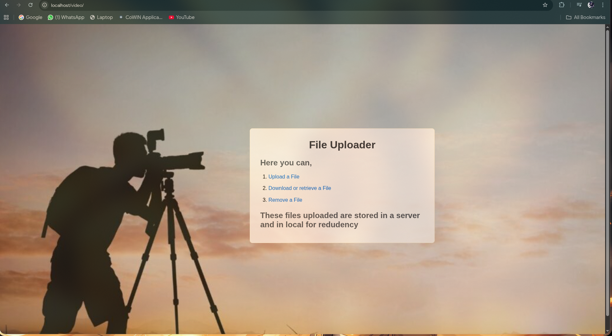
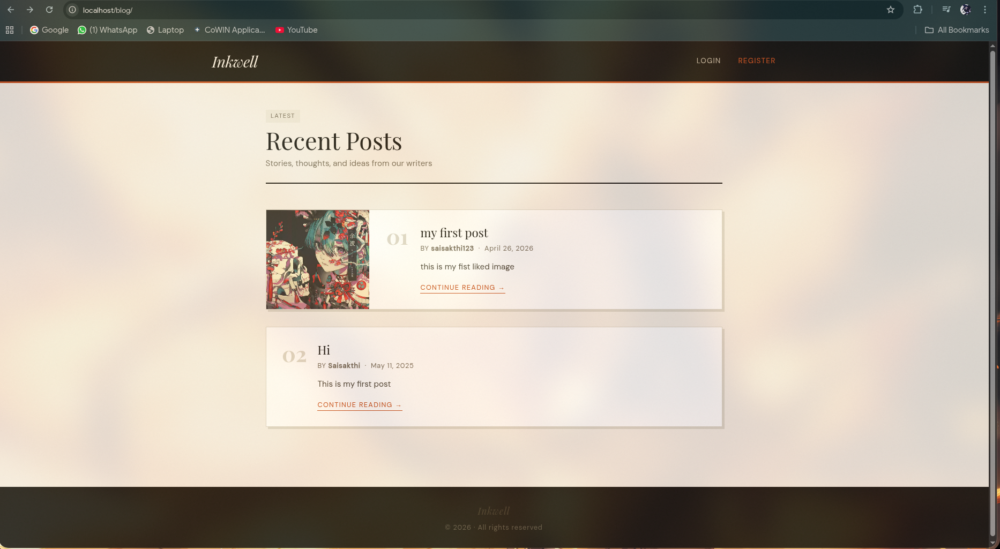
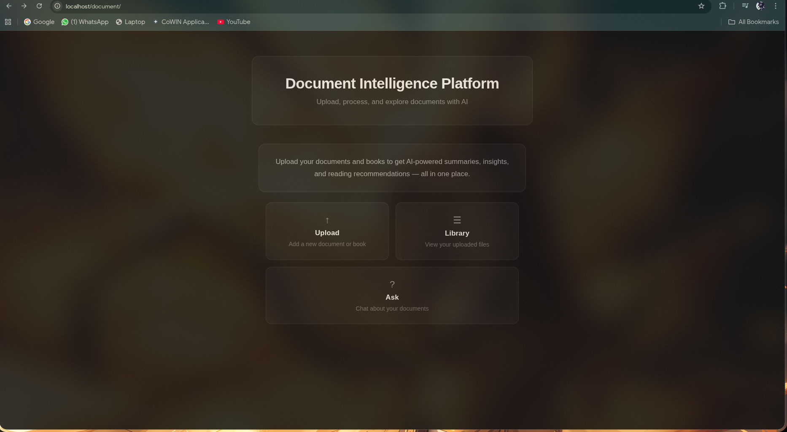

# 🧩 Full-Stack Project Cluster

> A unified, production-style monorepo hosting **10 full-stack applications** behind a single Nginx API gateway — provisioned with **Terraform + Terragrunt**, deployed across **Docker** and **Kubernetes (kind)**, with PR-based plan/apply via **Atlantis** and Kubernetes-side state handed off to **ArgoCD**.

---

## Table of Contents

- [Overview](#-overview)
- [Architecture](#-architecture)
- [Projects](#-projects)
- [Technology Stack](#-technology-stack)
- [Infrastructure & DevOps](#-infrastructure--devops)
- [Getting Started](#-getting-started)
- [Routing Map](#-routing-map)
- [Project Structure](#-project-structure)

---

## Overview

A **personal development cluster** — a collection of independently built, production-grade full-stack projects unified under a single Nginx gateway. Every app is containerized, infrastructure is managed as code with Terraform/Terragrunt, Kubernetes-side resources are reconciled by ArgoCD, and the entire cluster can be provisioned or torn down with a single command.

| | |
|---|---|
| **Total Applications** | 10 |
| **Backend Languages** | Python, Java, Go, Rust, Node.js |
| **Frontend** | React + Vite |
| **Databases** | PostgreSQL, MySQL, SQLite, Redis, Cassandra |
| **Message Broker** | Kafka |
| **Object Storage** | MinIO (S3-compatible) |
| **Containers** | Docker |
| **Orchestration** | Kubernetes via `kind` |
| **IaC** | Terraform + Terragrunt (5 environments) |
| **PR Automation** | Atlantis |
| **Kubernetes GitOps** | ArgoCD |
| **CI/CD** | Jenkins |
| **Gateway** | Nginx |
| **AI / LLM** | Google Gemini API, Ollama |


---

## Architecture

```
                     ┌──────────────────────────────────┐
                     │     Nginx Gateway :80 / :443      │
                     │  Let's Encrypt SSL — Single Entry │
                     └────────────────┬─────────────────┘
                                      │
        ┌─────────────────────────────┼──────────────────────────────┐
        │                            │                              │
  ┌─────▼──────┐             ┌───────▼──────┐             ┌─────────▼──────┐
  │  /notes/   │             │   /bank/     │             │   /quiz/        │
  │  Django    │             │ Spring Boot  │             │ React (static)  │
  │ PostgreSQL │             │ PostgreSQL   │             └────────────────┘
  └────────────┘             └──────────────┘
  ┌────────────┐             ┌──────────────┐             ┌────────────────┐
  │  /video/   │             │  /hospital/  │             │   /blog/        │
  │  Node.js   │             │   Django     │             │   Django        │
  └────────────┘             │   SQLite     │             │ MySQL + MinIO   │
                             └──────────────┘             └────────────────┘
  ┌────────────┐             ┌──────────────┐             ┌────────────────┐
  │/api-service│             │  /document/  │             │   /social/      │
  │  Node.js   │             │  Django      │             │  → kind cluster │
  │  Express   │             │MySQL + MinIO │             └────────────────┘
  └────────────┘             │ Gemini + LLM │
                             └──────────────┘
  ┌────────────┐
  │ /whisper/  │
  │ Rust+Axum  │
  │ PostgreSQL │
  │  + MinIO   │
  └────────────┘

                          Social Media App — kind cluster
                ┌────────────────────────────────────────────┐
                │   Django · Go MS · Java MS · React          │
                │   PostgreSQL · Redis · Kafka · Cassandra    │
                │   MinIO · ingress-nginx — all ArgoCD-synced │
                └────────────────────────────────────────────┘

                      Observability — kind cluster, ArgoCD-synced
                ┌────────────────────────────────────────────┐
                │  Prometheus · Grafana · Loki · Tempo ·      │
                │  Promtail · Jaeger · OTel Collector         │
                └────────────────────────────────────────────┘

                          Platform Tooling — gateway-net
                ┌────────────────────────────────────────────┐
                │     Jenkins (CI/CD)  ·  n8n (automation)    │
                └────────────────────────────────────────────┘
```

All Docker containers share the `gateway-net` bridge network. The Social Media App and the Observability stack both run inside a `kind` Kubernetes cluster, reconciled by ArgoCD rather than applied directly by Terraform. The gateway container is connected to both `gateway-net` and the `kind` network (via a dedicated `prod-manage` glue environment), so traffic flows seamlessly into the cluster's NodePort.

---

## 📦 Projects

### 0. Intro Page


| Layer | Technology |
|-------|-----------|
| Type | Static HTML |
| URL | `http://localhost/intro/` |

The cluster landing page — an overview of all apps with live links, architecture diagram, and tech stack. Provisioned automatically via Terraform using a `null_resource` that copies `intro/index.html` into the gateway volume.

---

### 1. Notes App


| Layer | Technology |
|-------|-----------|
| Frontend | React + Vite |
| Backend | Django (Python) |
| Database | PostgreSQL 16 |
| URL | `http://localhost/notes/` |

Create, read, update, and delete notes via a Django REST Framework API with persistent PostgreSQL storage.

---

### 2. Bank Manager


| Layer | Technology |
|-------|-----------|
| Frontend | React + Vite |
| Backend | Spring Boot (Java) |
| Database | PostgreSQL 16 Alpine |
| URL | `http://localhost/bank/` |

Account and transaction management with Spring Data JPA and a REST API built on Spring MVC.

---

### 3. Quiz App


| Layer | Technology |
|-------|-----------|
| Frontend | React + Vite |
| Backend | None (static) |
| URL | `http://localhost/quiz/` |

A fully client-side CS trivia quiz — no database, no API calls. Nginx serves the compiled static bundle directly.

---

### 4. Video Uploader



| Layer | Technology |
|-------|-----------|
| Frontend | React + Vite |
| Backend | Node.js |
| Storage | Local filesystem (`/app/Uploads`) |
| URL | `http://localhost/video/` |

Upload and stream video files via Node.js. The gateway supports up to 1 GB uploads.

---

### 5. Blog Website



| Layer | Technology |
|-------|-----------|
| Backend | Django (Python) |
| Database | MySQL 8.0 |
| Media Storage | MinIO (S3-compatible) |
| URL | `http://localhost/blog/` |

Full-featured blog with Django authentication, rich post creation, image uploads to MinIO, and an admin panel at `/blog/admin/`.

---

### 6. Hospital Management


| Layer | Technology |
|-------|-----------|
| Backend | Django (Python) |
| Database | SQLite |
| URL | `http://localhost/hospital/` |

Patient and appointment tracking using Django admin and template-based views. Lightweight — no separate DB container needed.

---

### 7. API Service


| Layer | Technology |
|-------|-----------|
| Frontend | React + Vite |
| Backend | Node.js + Express |
| External API | OpenWeatherMap |
| URL | `http://localhost/api-service/` |

Live weather data via OpenWeatherMap, served through Express routes with a React frontend for interactive exploration.

---

### 8. Document Intelligence Platform



| Layer | Technology |
|-------|-----------|
| Frontend | React + Vite |
| Backend | Django (Python) |
| Database | MySQL 8.0 |
| Object Storage | MinIO |
| AI | Google Gemini API + Ollama (local LLM) |
| URL | `http://localhost/document/` |

Upload PDF documents stored in MinIO and run AI-powered Q&A against them via Gemini API or local Ollama inference. Gateway timeout is extended to 120s for large inference requests.

---

### 9. Social Media App


| Component | Technology |
|-----------|-----------|
| Frontend | React (served via Nginx) |
| Backend API | Django (Python) |
| Microservice — Go | Caching / real-time layer (Redis) |
| Microservice — Java | Spring Boot, reactive, domain-specific logic |
| Database | PostgreSQL 15 (K8s StatefulSet) |
| Cache | Redis 7 |
| Message Broker | Kafka (Confluent image) |
| Wide-Column Store | Cassandra 5.0 |
| Object Storage | MinIO |
| Orchestration | Kubernetes via `kind` |
| Ingress | ingress-nginx (Helm chart, synced by ArgoCD) |
| URL | `http://localhost/social/` |

The most complex project — a microservices platform running on a local Kubernetes cluster. Kafka and Cassandra back the Java microservice's reactive domain logic. Every Kubernetes object here — Postgres, Redis, Kafka, Cassandra, MinIO, the Go/Java microservices, the Django/React deployments, and ingress-nginx itself — is plain YAML under `gitops/social-media/`, synced by ArgoCD rather than applied by Terraform. The gateway bridges to the `kind` network so `/social/` traffic proxies directly into the cluster's NodePort.

> The observability stack (Prometheus, Grafana, Loki, Tempo, Promtail, Jaeger, OTel Collector) is **live**, not scaffolded — deployed as ArgoCD `Application` objects under `gitops/observability/` and reachable at `/grafana/`, `/jaeger/`, and `/otel/`.

---

### 10. Whisper


| Layer | Technology |
|-------|-----------|
| Frontend | React + Vite |
| Backend | Rust (Axum) |
| Database | PostgreSQL 15 Alpine |
| Object Storage | MinIO |
| Auth | JWT (jsonwebtoken + bcrypt) |
| Realtime | WebSocket |
| URL | `http://localhost/whisper/` |

A WhatsApp-style real-time chat app. The Axum backend handles WebSocket messaging, JWT-based auth, and media uploads to MinIO; the React frontend talks to it over `/whisper/api/` and `/whisper/ws/`.

---

## 🛠️ Technology Stack

| Language | Used In |
|----------|---------|
| Python | Notes, Blog, Hospital, Document, Social (Django) |
| Java | Bank Manager (Spring Boot), Social (Java microservice) |
| Go | Social Media (Go microservice) |
| Rust | Whisper (Axum backend) |
| JavaScript / Node.js | API Service, Video Uploader |
| TypeScript / JSX | All React + Vite frontends |

| Database | Used By |
|----------|---------|
| PostgreSQL 16 | Notes App, Bank Manager |
| PostgreSQL 15 | Whisper, Social Media App (K8s StatefulSet) |
| MySQL 8.0 | Blog Website, Document Intelligence Platform |
| SQLite | Hospital Management |
| Redis 7 | Social Media App (caching layer) |
| Cassandra 5.0 | Social Media App (Java microservice, K8s StatefulSet) |
| Kafka | Social Media App (Java microservice messaging, K8s) |

| Tool | Purpose |
|------|---------|
| Docker | Containerization of all services |
| Terraform | Cluster IaC — images, containers, volumes, ArgoCD bootstrap, K8s Secrets |
| Terragrunt | Splits Terraform into 5 dependency-ordered environments, generates per-env backends |
| Atlantis | PR-based `plan`/`apply` automation, gated on approval + mergeability |
| Kubernetes (`kind`) | Local K8s cluster for Social Media App + observability stack |
| ArgoCD | GitOps sync of all Kubernetes-side YAML — replaces `kubectl_manifest`/`helm_release` |
| Helm | Chart source for ingress-nginx, kube-prometheus-stack, Loki, Tempo, Promtail, Jaeger, OTel Collector — all installed via ArgoCD's Helm source, not the CLI |
| Nginx | API Gateway — single entry point for all apps |
| MinIO | S3-compatible object storage (Blog, Document, Social, Whisper) |
| Jenkins | Self-hosted CI/CD, dockerized, git-diff-based selective build/test/deploy |
| n8n | Self-hosted workflow automation |
| Google Gemini API | Document Q&A |
| Ollama | Self-hosted local LLM inference |

---

## ⚙️ Infrastructure & DevOps

### Terraform + Terragrunt

The original single `main.tf` has been split into **five purpose-scoped environments**, each with its own local Terraform state, wired together by Terragrunt's `dependencies` block (ordering only — no environment reads another's outputs; anything shared, like the `gateway-net` network name, is a literal string both sides agree on):

```
environments/
  terragrunt.hcl        # root: generates a local backend per environment
  prod-gateway/         # foundation — gateway-net network + nginx, zero dependencies
  prod-social/          # foundation — kind cluster, ArgoCD, social-media images/secrets
  prod-docker/          # every non-k8s app stack (notes, bank, quiz, video, whisper, ...)
  prod-infra/           # otel-gateway, node-exporter, n8n, jenkins + the observability app-of-apps
  prod-manage/          # one glue resource: connects gateway's container to the kind network
```

```
prod-gateway ─┬─→ prod-docker
              ├─→ prod-infra ←─ prod-social
              └─→ prod-manage ←─ prod-social
```

`prod-gateway` and `prod-social` have no dependencies and apply in parallel; everything else waits on one or both of them.

### Atlantis

Terraform changes are planned and applied through Atlantis rather than ad-hoc `terraform apply`. Each environment is its own Atlantis project, autoplanning on changes to its own `.tf`/`.tfvars`/`terragrunt.hcl` (and, for `prod-social`/`prod-infra`, changes under `gitops/`), with `apply_requirements: [approved, mergeable]` gating the apply step. `parallel_apply` is disabled on purpose — apply order matters here, so Atlantis applies one project at a time in the order above.

**Note: Still Developing, not fully deployed**

### ArgoCD — Kubernetes GitOps

Everything that used to be a `kubectl_manifest` or `helm_release` resource inside Terraform's Kubernetes provider now lives as plain YAML under `gitops/`, synced by ArgoCD instead:

- `gitops/social-media/{raw,apps}/` — Postgres, Redis, Kafka, Cassandra, MinIO, the Go/Java microservices, Django/React deployments, and an `ingress-nginx` Helm Application.
- `gitops/observability/{raw,apps}/` — one ArgoCD `Application` per chart (kube-prometheus-stack, Loki, Tempo, Promtail, Jaeger, OTel Collector, observability Redis) plus the leftover raw manifests (OTel NodePort, Jaeger config, ingresses).

`prod-social` and `prod-infra` each create exactly one Terraform-managed "app-of-apps" `Application` pointing at one of those folders — Terraform's Kubernetes-side job shrank to bootstrapping the cluster, installing ArgoCD, creating the Secrets that shouldn't be in git (`postgres-secret`, `social-minio-secret`, the observability Redis password), and creating that single pointer object.

### Smart Rebuild Triggers

Each Docker image still uses a `dir_sha` trigger — a hash of all source files. Images only rebuild when source code actually changes:

```hcl
triggers = {
  dir_sha = sha256(join("", [
    for f in fileset(path.module, "**") :
    filesha256("${f}")
    if !can(regex("(__pycache__|node_modules|dist|target|\\.git)", f))
  ]))
}
```

### kind + Gateway Network Bridge

Connecting the gateway container to the `kind` cluster's Docker network is now its own environment (`prod-manage`) — a single `local-exec` resource that depends, via Terragrunt ordering only, on both `prod-gateway` and `prod-social` having applied first:

```bash
docker network connect kind gateway   # prod-manage handles this automatically
```

### CI/CD — Jenkins

A self-hosted, dockerized Jenkins instance (managed via Terraform in `prod-infra`) runs a smart pipeline that uses `git diff` to detect changed apps and selectively test/build/deploy only what moved, grouped into sequential parallel test stages (Django → Node/React → Java/Maven).

---

## 🚀 Getting Started

### Prerequisites

| Tool | Install |
|------|---------|
| Docker Desktop | https://docs.docker.com/desktop/ |
| Terraform | https://developer.hashicorp.com/terraform/install |
| Terragrunt | https://terragrunt.gruntwork.io/docs/getting-started/install/ |
| `kind` | https://kind.sigs.k8s.io/docs/user/quick-start/ |
| `kubectl` | https://kubernetes.io/docs/tasks/tools/ |
| `helm` (optional) | https://helm.sh/docs/intro/install/ — handy for inspecting charts, though ArgoCD installs them for you |
| Atlantis (optional) | https://www.runatlantis.io/docs/installation-guide.html — only needed if you want PR-gated applies instead of running Terragrunt locally |

### Bring Up the Cluster

```bash
git clone <your-repo-url>
cd <repo>/infra/environments

terragrunt run-all apply
```

Terragrunt reads each environment's `dependencies` block and applies in the right order automatically. Each environment can also be applied on its own for routine changes:

```bash
cd prod-gateway && terragrunt apply   # foundation, no deps
cd ../prod-social && terragrunt apply # foundation, no deps — can run alongside prod-gateway
cd ../prod-docker && terragrunt apply
cd ../prod-infra && terragrunt apply
cd ../prod-manage && terragrunt apply
```

**Before your first apply anywhere**, replace `git@github.com:SaisakthiM/Coding-Project.git` in:
- `environments/prod-social/terraform.tfvars` (`gitops_repo_url`)
- `environments/prod-infra/terraform.tfvars` (`gitops_repo_url`)
- `gitops/social-media/apps/social-workload-app.yaml`
- every file under `gitops/observability/apps/` that has a `git@github.com:SaisakthiM/Coding-Project.git` source

with wherever you're actually pushing this whole tree — ArgoCD needs to be able to clone it.

All apps will be live at `http://localhost/<app>/` once provisioned.

### Tear Down

```bash
cd infra/environments
terragrunt run-all destroy
```

---

## 🗺️ Routing Map

| URL | App | Backend |
|-----|-----|---------|
| `http://localhost/intro/` | Intro Page | Static |
| `http://localhost/notes/` | Notes App | `notes-backend:8000` |
| `http://localhost/notes/api/` | Notes REST API | `notes-backend:8000` → `/api/` |
| `http://localhost/bank/` | Bank Manager | `bank-backend:8080` |
| `http://localhost/bank/api/` | Bank REST API | `bank-backend:8080` → `/api/` |
| `http://localhost/quiz/` | Quiz App | Static |
| `http://localhost/video/` | Video Uploader | `video-uploader-backend:8080` |
| `http://localhost/hospital/` | Hospital Management | `hospital-management:8000` |
| `http://localhost/blog/` | Blog Website | `blog-website:8000` |
| `http://localhost/blog/minio/` | Blog media files | `blog-minio:9000` |
| `http://localhost/api-service/` | API Service | `api-service-backend:8000` |
| `http://localhost/document/` | Document Platform | `doc-backend:8000` |
| `http://localhost/whisper/` | Whisper | `whisper_backend:8000` |
| `http://localhost/whisper/api/` | Whisper REST API | `whisper_backend:8000` |
| `http://localhost/whisper/ws/` | Whisper WebSocket | `whisper_backend:8000` → `/ws/` |
| `http://localhost/social/` | Social Media App | `kind` → ingress-nginx (NodePort) |
| `http://localhost/social/api/` | Social REST API | `kind` → Django pod |
| `http://localhost/social/minio/` | Social media files | `kind` → MinIO pod |
| `http://localhost/grafana/` | Observability dashboards | `kind` → Grafana pod |
| `http://localhost/jaeger/` | Distributed tracing UI | `kind` → Jaeger pod |
| `http://localhost/otel/` | OTLP ingest | `kind` → OTel Collector |
| `http://localhost/argocd/` | ArgoCD UI | `kind` → ArgoCD server |
| `http://localhost/jenkins/` | Jenkins CI/CD | `jenkins:8080` |
| `http://localhost/n8n/` | n8n automation | `n8n:5678` |
| `http://localhost/record/` | Pentest report | Static |

### Gateway Health Check

```bash
curl http://localhost/
# {"status":"gateway running","apps":["/notes/","/bank/","/quiz/","/video/","/hospital/","/blog/","/social/","/api-service/","/document/","/whisper/"]}
```

---

## 📁 Project Structure

```

Terraform
    └── infra/
        ├── README.md                       # Terragrunt/ArgoCD migration notes
        ├── atlantis.yaml                   # PR-based plan/apply config
        │
        ├── environments/
        │   ├── terragrunt.hcl               # root config — per-env local backend
        │   ├── prod-gateway/                # gateway-net network + nginx
        │   │   └── nginx/default.conf       # all routing lives here
        │   ├── prod-docker/                 # notes, bank, quiz, video, whisper, hospital, blog, api-service, document
        │   ├── prod-social/                 # kind cluster, ArgoCD install, social-media images/secrets
        │   ├── prod-infra/                  # otel-gateway, node-exporter, n8n, jenkins, observability app-of-apps
        │   └── prod-manage/                 # gateway ↔ kind network glue
        │
        ├── modules/
        │   ├── docker_app/                  # shared docker_container + network module
        │   └── networking/                  # wraps docker_network
        │
        ├── gitops/
        │   ├── social-media/{raw,apps}/     # ArgoCD-synced: postgres, redis, kafka, cassandra, minio, go/java MS, django/react, ingress-nginx
        │   └── observability/{raw,apps}/    # ArgoCD-synced: kube-prometheus-stack, loki, tempo, promtail, jaeger, otel-collector
        │
        └── projects/
            ├── API Service/
            │   ├── backend/                    # Node.js + Express
            │   └── frontend/api-service/       # React + Vite
            │
            ├── Bank Manager/
            │   ├── backend/bank_management/    # Spring Boot (Java)
            │   └── frontend/                    # React + Vite
            │
            ├── Blog Website/
            │   ├── blogsite/                   # Django project
            │   └── Dockerfile
            │
            ├── Document Intelligence Platform/
            │   ├── backend/document_backend/   # Django + Gemini + Ollama
            │   ├── frontend/document_frontend/ # React + Vite
            │   └── storage/minio/
            │
            ├── hospital_management/            # Django + SQLite
            │
            ├── intro/
            │   └── index.html                  # Cluster intro page (static)
            │
            ├── Notes App/
            │   ├── backend/                    # Django
            │   └── frontend/notes_app_frontend/ # React + Vite
            │
            ├── Quiz App/
            │   └── quiz-app/                   # React + Vite (fully static)
            │
            ├── security_tests/                 # pentest report (record.html)
            │
            ├── Social Media App/
            │   ├── apps/
            │   │   ├── backend/                # Django
            │   │   ├── frontend/                # React
            │   │   ├── microservice-go/         # Go microservice
            │   │   └── microservice-java/       # Spring Boot microservice (reactive, Cassandra, Kafka)
            │   ├── infrastructure/kind/         # kind cluster config YAML
            │   ├── platform/observability/      # Helm values: prometheus.yml, loki-config.yml, tempo-config.yml, ...
            │   └── storage/minio/
            │
            ├── Video Uploader/
            │   └── Main/
            │       ├── backend/                # Node.js
            │       └── frontend/                # React + Vite
            │
            └── Whatsapp/                       # "Whisper" — real-time chat app
                ├── whatsapp-backend/            # Rust + Axum, WebSocket, JWT, sqlx/Postgres, MinIO
                └── whatsapp-frontend/           # React + Vite
```

---

## 📝 Notes

- All credentials in this repo are for **local and for production development**. Real secrets (Postgres password, social MinIO user/password, observability Redis password) are created directly as Kubernetes `Secret` objects by Terraform secrets are managed inside tfvars which are **not** committed to git. and you have to manually create tfvars in each env there for it to work
- The `kind` cluster must already exist before applying `prod-infra`/`prod-manage` if their resources are already in Terraform state — Terragrunt's dependency graph (or `terragrunt run-all apply`) handles this for you on a fresh box.
- Frontend containers marked `must_run = false` / `restart = no` are one-shot build containers — they copy compiled static assets into a named volume and exit. This is expected behaviour.
- The observability stack (Prometheus, Grafana, Loki, Tempo, Promtail, Jaeger, OTel Collector) is **live**, ArgoCD-managed, and reachable at `/grafana/`, `/jaeger/`, and `/otel/` — no longer commented out.
- Helm chart versions in `gitops/*/apps/*.yaml` are placeholders pinned at whatever was current when this was migrated off Terraform's `helm_release` — run `helm search repo <chart> --versions` and pin deliberately before relying on any of them.

---

---

## 🔍 FAQ's About this Project

**Q) Why Terraform and not Docker-Compose**
Ans) The answer is simple, as i scaled this project from 1-2 to like 9, it becomes difficutl to maintain all the database frontend backend networks volumes etc inside a compose file. That's why i wanted a tool to manage infrastructure not a monolithic project

**Q) Why Argo CD manages Kubernetes not Docker-Compose transition**
Ans) Simple answer, Self healing, that's the feature I really wanted because if i created all the containers in a compose, I have to change, rebuild deployment, secrets and services and delete pod which is tiring. So when i learnt Argo CD which could manage all these things just by changing git and I don't have to manually manage, I immediately choose it. but there is a tradeoff, I did not add any tests for the changes so i should pray to kubernetes and make the changes so it does not break

**Q) Why Multiple Database Instances instead of singe source database**
Ans) This is a good question it is a tradeoff between storage and Isolation. I created a isolated environment for each of my application with its own database instance I could have used a single database instance and connect all others like poatgres but that same dependency could cause issue if that one is gone Instead multiple ones setup if one failed rest of the instance runs fine

**Q) Why Kubernetes?**
Ans) I wanted to learn container orchestration beyond Docker Compose. Kubernetes provided self-healing, service discovery, rolling updates, and declarative application management. While it introduces complexity, it allowed me to explore production-style deployment patterns.

**Q) Why Kafka?**

Ans) I know Kafka is used for Event-Driven Architecture but I thought it would be good for Notification system for one of my project so I added it as a Microservice and using it

---

---

## 📖 Lesson Learned

* Be ready to sit for 12 hours staring at a url mismatch in your proxy and certificate errors, but on a more serious note, what I learnt is persistence to problems, before that I would just quit the program if I get errors, this project made me **Error Tolerant** in professional terms

* This project told me "your dummy projects won't survive a second in production" like a slap to the face. I learnt that in the hard way when I intergrate anything like a reverse proxy or terraform. The errors cascade when intergrated and that taught me thinking in systems not as a developer

* There is more to learn, the world of CS is vast and updates fast, every second a breaking changes arrives and breaks your brain. Keep learning and don't give up

* And there is a thing called documentation, which in my experience is a hell to write but I know the importance because future me will stare at present me and tell "What the hell is this". sorry future me, even after doing this big project, i can't write documentation RIP future me


---


<p align="center">
  Built and maintained by <strong>Saisakthi</strong> &nbsp;·&nbsp; Local development cluster &nbsp;·&nbsp; Not for production use
</p>